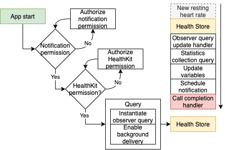
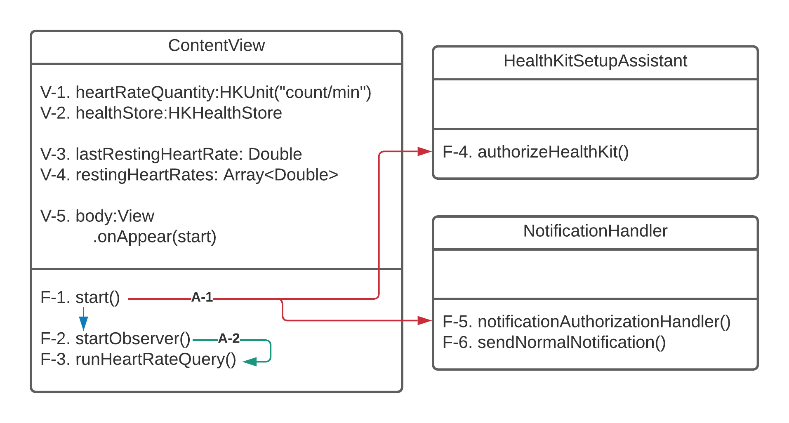

# Background-App
Simple application for testing the observer query's background functionality. The work was done as part of my master thesis.

# Flow

The application's main flow is the column on the right, which describes the events leading to a notification being dispatched. The left side concerns the actual application on the phone with setup, including authorizing User Notification- and HealthKit frameworks and the application instantiating the background observer query.
henever a new resting heart rate value is stored or the existing value is updated, the HealthKit framework will trigger the observer query's update handler. The update handler will then call for a statistics collection query that updates the app's existing variables. If the resting heart rate is, in fact, changed, it will schedule a notification in the notification center. The notification is then supposed to be dispatched, and it is possible to verify if the background functionality is working or not. 

# Class diagram

This application has the same user interface as the Resting Heart Rate App and has some identical elements in the class diagram. 

 - [V-1,2,3,4,5] the same as in the [Resting Heart Rate App](https://github.com/Jaanesen/Resting-Heart-Rate-App).
 - [F-1] Start function. Initializes the application by calling F-4 to authorize the required HealthKit permissions, and F-5 to authorize the use of User Notifications. When the required permissions are obtained, the function starts the observer query by calling F-2.
 - [F-2] Start observer query function. This function initializes an observer query with a completion handler which calls the F-3 function to fetch the observed change in resting heart rate.
 - [F-3] Run heart rate query function. Checks the fetched HR and calls F-6 with the required parameters to dispatch a notification.
 - [F-4] Handles permission to read/write health-related data, specifically in this example: resting heart rate.
 - [F-5] Handles permission to display notifications.
 - [F-6] Notification dispatching function. With two additional parameters: title: String, body: String.
 - [A-1] Red line illustrates F-1 calling F-4 and F-5.
 - [A-2] Green line illustrates F-2 calling F-3 every time the observer query is triggered.
